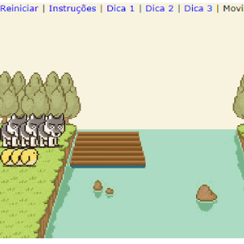

# Lobos e galinhas

INSTRUÇÕES:
Leve os três lobos e três galinhas para o lado direito do rio obedecendo as seguintes regras:

- Não mais do que dois animais podem pilotar o barco ao mesmo tempo.

- Deve haver pelo menos um animal no barco para ele se mover.

- Se mais lobos que galinhas ficarem em qualquer lado do rio, os lobos irão comer as galinhas e você irá reiniciar o jogo.

Para pôr um animal no barco clique no animal. Para atravessar o rio, clique no barco. Você pode mover o barco quantas vezes quiser, mas o feito pode ser conseguido em apenas 11 movimentos.

<kbd></kbd>

https://shuantsu.github.io/lobos_e_galinhas